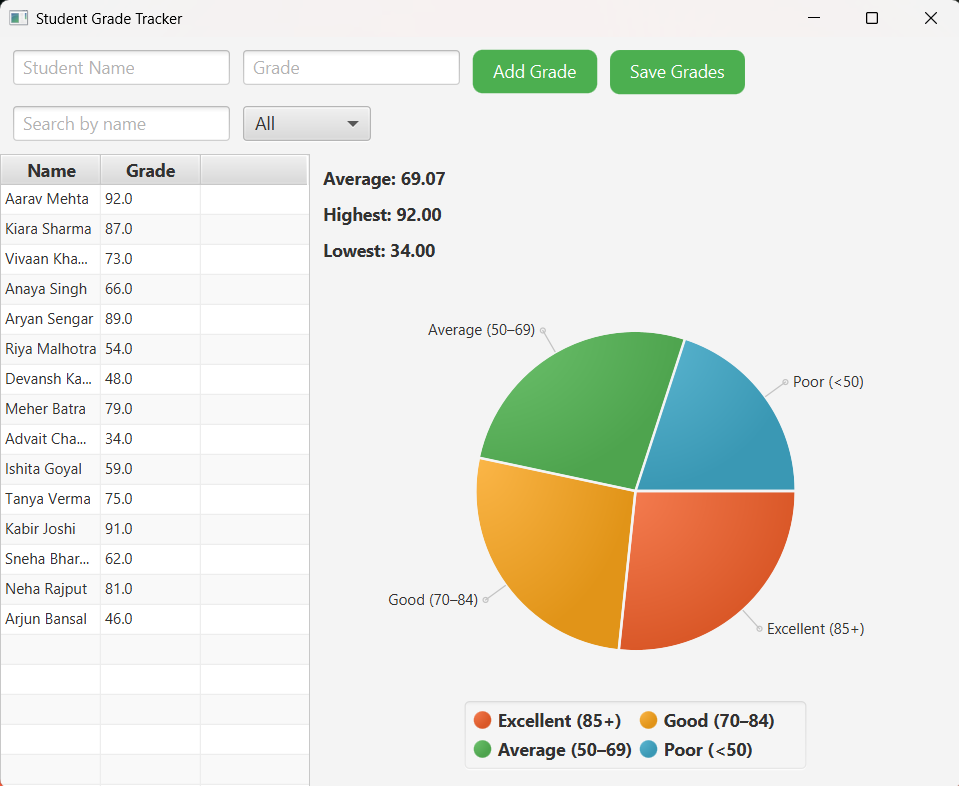

# 🎓 Student Grade Tracker

A JavaFX desktop application to manage and visualize student grades with real-time statistics and a pie chart.

## 📌 Features

- Add student names and grades with input validation
- View average, highest, and lowest grades
- Dynamic PieChart for performance visualization
- Search students by name
- Filter by performance category (Excellent, Good, Average, Poor)
- Save student data to a `.txt` file

## 🛠️ Technologies Used

- Java 24
- JavaFX SDK 24.0.1
- FXML (built using Scene Builder)
- CSS for UI styling

## 📁 Project Structure

```
Student-Grade-Tracker/
├── src/
│   └── application/
│       ├── Main.java
│       ├── Controller.java
│       ├── Student.java
│       ├── dashboard.fxml
│       └── style.css
├── Student_Grade_Tracker_Report.docx
├── README.md
```

## 🚀 How to Run

1. Make sure you have Java 24 and JavaFX SDK 24.0.1 set up.
2. Set VM options in your IDE (like IntelliJ IDEA or Eclipse) as:
    ```
    --module-path "C:\javafx-sdk-24.0.1\lib" --add-modules javafx.controls,javafx.fxml
    ```
3. Run `Main.java`.

## 🖥️ Demo Screenshots
 
 # Dashboard 
 [](assets/dashboard.png)

 # Result
 [](assets/result_1.png)
 [](assets/result_2.png)
 [](assets/result_3.png)
 [](assets/result_4.png)
 [](assets/result_5.png)
 [](assets/result_6.png)

 # Generated File
 [](assets/file_preview.png)
 
## 🧾 Report

The project report (`Student Grade Tracker Report.docx`) is included in the repository and covers:
- Introduction, Problem Statement, Key Observations
- Features and Functionality
- Future Scope

## 🧑‍🎓 Developer

**Aryan Sengar**  
B.Tech CSE (AI & ML), The NorthCap University  
📍 Gurgaon, India  

## 📄 License

This project is open-source for educational purposes.
